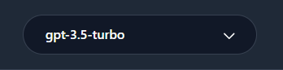
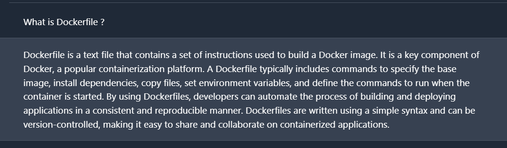
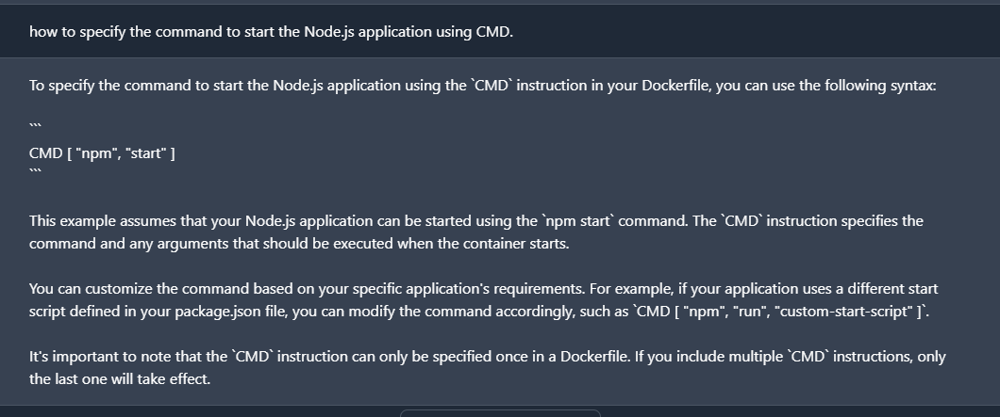

**Title: Writing a Dockerfile for Node.js App Deployment**

Estimate Time : 25 Min

**Objective:**

- Acquire proficiency in utilizing ChatGPT for Dockerfile creation. 
- Develop effective questioning skills for Dockerfile creation inquiries. 
- Utilize IBM's generative AI lab to generate the necessary response for Dockerfile creation. 
- Ensure clarity and precision in providing details when seeking results from ChatGPT. 

*Note: Please note Generative AI is an evolving field. As you attempt the labs, your experience and output might be different than what is seen here.*

In this lab, we'll explore how generative AI can assist in creating a Dockerfile for a Node.js application. We'll be utilizing IBM's generative AI lab, powered by advanced language models. The goal is to generate the necessary code for our Dockerfile, simplifying the development of our Node.js application in a Docker environment.

Prologue: 

#### What is a Dockerfile and why do we use the same?

A Dockerfile is like a recipe for your application's environment. It contains a set of instructions that Docker uses to build a Docker image. This image, in turn, is a lightweight, standalone, and executable package that includes everything needed to run a piece of software, including the code, runtime, libraries, and system tools. 

Dockerfiles are crucial in the world of containerization, offering a standardized and reproducible way to package and deploy applications. They allow developers to encapsulate their applications and dependencies, ensuring consistent behavior across different environments. This not only simplifies the development process but also facilitates seamless collaboration and deployment. 

### Now, let’s direct a few questions to Generative AI to craft a Dockerfile.

## Step 1: Set up the AI Classroom

The generative AI classroom is a tool where you can write and compare your prompts to generate desired text with real-time chat responses.  

You will have both the generative AI classroom environment and instructions on one page in a browser. The instructions will be on the left half of the screen, and the generative AI classroom will be on the right half of the screen. You can interact with the language model using the message and chat fields.  

Your AI Classroom will look similar to the screenshot shown below: 

To begin, configure your AI classroom to optimize your learning experience, by following these steps:

#### 1. Name the Chat:
Click the pencil in the top-left corner to give your chat a name.

#### 2. Choose the Model:
Go to the top-right corner and choose gpt-3.5-turbo from the drop-down for the text generation exercise. (By default, it's set to gpt-3.5.) 

#### 3. Provide Prompt Instructions:
Use the "Prompt Instructions" field in the upper right pane of the chat system to give instructions or specific details about the context of the required output. These instructions will be locked once the chat starts and cannot be modified later. 

#### 4. Type Your Message:
Use the text box at the bottom of the page to enter queries and converse with the chat system. Enter your prompt to generate a Dockerfile, `Generate a Dockerfile for a Node.js application,` and click on `Start Chat.` 

## Step 2: Start Generating Dockerfile

Once your AI Classroom is ready, let's proceed and ask Generative AI for assistance in writing a Dockerfile.

1. Enter your question in message box `What is Dockerfile ?`

View the AI's response for an explanation of what a Dockerfile is.

2. Enter your question in message box `What are the requirements for a Dockerfile?`

Read the AI's response and proceed to ask individual questions regarding Dockerfile requirements.

3. Enter your question in message box `What's the first crucial step when creating a Dockerfile for a Node.js application?`

Understand the initial step after selecting the base image for a Node.js Dockerfile.

4. Enter your question in message box `Following the base image selection, Set the working directory inside the container to /app`

Learn the subsequent step to define the working directory inside the container.

5. Enter your question in message box `As selected working directory /app, bring the package.json and package-lock.json  to the working directory`

Understand the process of bringing package files into the working directory.

6. Enter your question in message box `Now how i install dependencies ? and Copy the remaining application code to the working directory ?`

Get guidance on installing dependencies and copying the remaining application code.

7. Enter your question in message box `Node.js app needs to be accessible on a specific port, what Dockerfile instruction do you include for this purpose?`

Learn the instruction to include for exposing a specific port.

8. Enter your question in message box `how to specify the command to start the Node.js application using CMD ?`

Understand the final step in specifying the command to start the Node.js application.

9. Enter your question in message box `Combine all the steps to form a complete Dockerfile for a Node.js application`

View the generated Dockerfile as a result of combining all the steps.

### Congratulations: 

You have leveraged generative AI and developed a complete Dockerfile for a Node.js application.

### Summary:

In this lab, we leveraged generative AI to simplify the creation of a Dockerfile for a Node.js application by interacting with the AI in the designated classroom and addressing key questions and steps involved in Dockerfile development. The generated Dockerfile serves as a foundation for deploying Node.js applications in a containerized environment. This experience showcases the potential of generative AI in enhancing the efficiency of Docker-based development workflows. Through guided interactions, learners gain valuable insights into the Dockerfile creation process, making it more accessible and practical for real-world application deployments. 