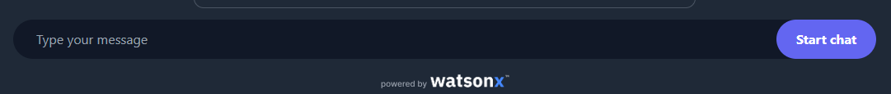

**Title: Writing a Dockerfile for Node.js App Deployment**

**Introduction:**
In this lab, we'll explore how generative AI can assist in creating a Dockerfile for a Node.js application. We'll be utilizing IBM's generative AI lab, powered by advanced language models. The goal is to generate the necessary code for our Dockerfile, simplifying the development of our Node.js application in a Docker environment.

**Lab Objective:**

- **AI Assistance Introduction:** Explore generative AI's role in simplifying Dockerfile creation for Node.js apps.

- **Classroom Setup:** Personalize the chat and choose the text generation model.

- **Prompt Instructions:** Provide specific guidance for Dockerfile generation, covering key Node.js deployment steps.

- **Message Input:** Input a prompt instructing AI to generate a Dockerfile for a Node.js app.

- **Result Analysis:** Evaluate the generated Dockerfile to ensure alignment with specified instructions.

- **Conclusion:** Summarize generative AI's impact on streamlining Node.js app deployment workflows.


## Step 1: Set up the AI Classroom
As a first step, set up your AI classroom for an enhanced learning experience.

Before starting the exercise, follow these steps:

### 1. Name the Chat:
Use the pencil icon in the top-left corner of the right pane to name the chat.


### 2. Choose the Model:
Use the dropdown option in the top-right corner of the right pane for the text generation exercise.


## Step 2: Start Generating Dockerfile

### 1. Provide Prompt Instructions:
Use the "Prompt Instructions" field in the upper right pane of the chat system to give instructions or specific details about the context of the required output. These instructions will be locked once the chat starts and cannot be modified later.

Set prompt instructions as follows:
```
1. Start with the official Node.js runtime as the base image.
2. Set the working directory inside the container to /app.
3. Copy the package.json and package-lock.json files to the working directory.
4. Install application dependencies using npm install --production.
5. Copy the remaining application code to the working directory.
6. Expose port 3000.
7. Specify the command to start the Node.js application using CMD.
8. Assume the main file is named app.js; adjust accordingly based on your application's entry point file.
```


### 2. Type Your Message:
Use the text box at the bottom of the page to write prompts and converse with the chat system. Enter your prompt to generate a Dockerfile, `Generate a Dockerfile for a Node.js application,` and click on `Start Chat.`




### 3. Result - Dockerfile Generation

Upon completion of the chat, you'll receive a generated Dockerfile. Here's an example:


```
# Step 1: Use the official Node.js runtime as the base image
FROM node:latest

# Step 2: Set the working directory inside the container to /app
WORKDIR /app

# Step 3: Copy the package.json and package-lock.json files to the working directory
COPY package*.json ./

# Step 4: Install application dependencies using npm install --production
RUN npm install --production

# Step 5: Copy the remaining application code to the working directory
COPY . .

# Step 6: Expose port 3000
EXPOSE 3000

# Step 7: Specify the command to start the Node.js application using CMD
CMD ["node", "app.js"]
```

Please note that in Step 8, the command assumes that your main file is named app.js. Adjust it based on your application's entry point file.

**Lab Conclusion:**
This lab showcased the use of generative AI to streamline the Dockerfile creation process for a Node.js application. The generated Dockerfile provides a foundation for deploying Node.js applications in a containerized environment. This approach can significantly enhance the efficiency of development workflows, particularly in Docker-based projects.